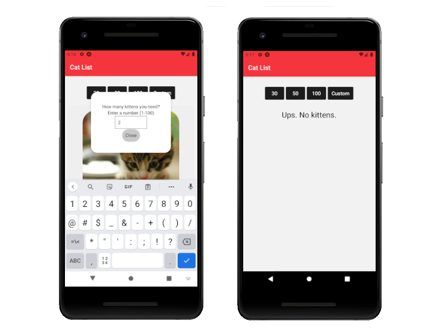

# Kitten-App

## General info

- A Simple app to where you can get cats list with random name and random image.
- You can also view individual cat info by pressing on cat's name.
- You can find images API here: https://placekitten.com/

## Technologies

- [Node.js](https://nodejs.org)
- [Expo CLI](https://expo.io)
- Made with REACT NATIVE

## Setup

To run this project, install it locally using npm:

```
$ cd ../kitten-app
$ npm install
$ npm start
```

## Images



